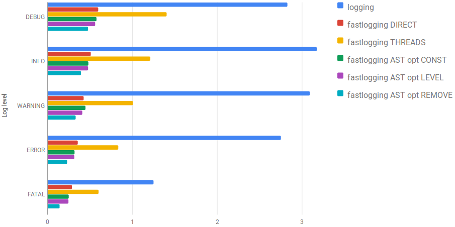
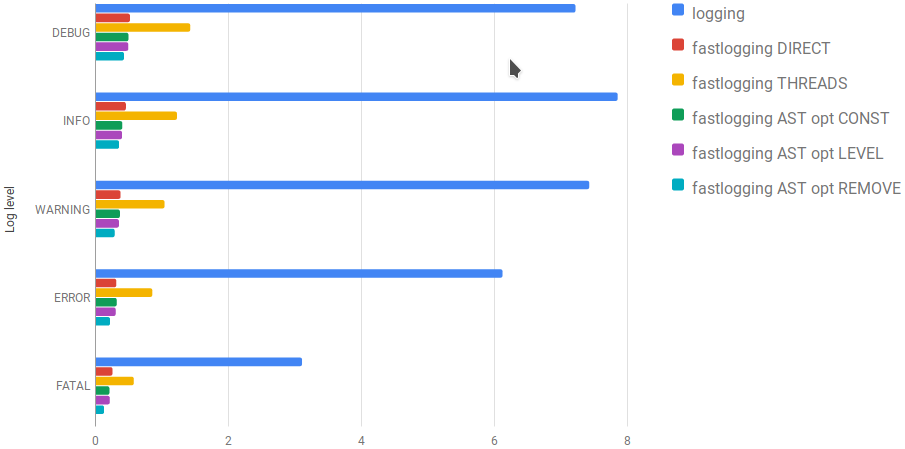

An efficient and feature-rich logging module
============================================

.. role:: Python(code)
   :language: Python

The ``fastlogging`` module is a faster replacement of the standard logging module with a mostly compatible API.

It comes with the following features:

 - (colored, if colorama is installed) logging to console
 - logging to file (maximum file size with rotating/history feature can be configured)
 - old log files can be compressed (the compression algorithm can be configured)
 - count same successive messages within a 30s time frame and log only once the message with the counted value.
 - log domains
 - log to different files
 - writing to log files is done in (per file) background threads, if configured
 - configure callback function for custom detection of same successive log messages
 - configure callback function for custom message formatter
 - configure callback function for custom log writer

The API is described `here <doc/API.rst>`_.

Installation
------------

Simply run

.. code-block:: Python

    python setup.py install --user

or create a wheel and install it.

.. code-block:: Python

    python setup.py bdist_wheel

An optimized version of ``fastlogging`` will be installed if package **cython** is installed.
If you need a pure python version of the ``fastlogging`` module then add option **nocython**.

Usage
-----

.. code-block:: Python

    from fastlogging import LogInit

    logger = LogInit(pathName="/tmp/example1.log", console=True, colors=True)
    logger.debug("This is a debug message.")
    logger.info("This is an info message.")
    logger.warning("This is a warning message.")
    logger.rotate()
    logger.fatal("This is a fatal message.")
    logger.shutdown()

The example above writes all messages to a file and to the console. On the console the messages are printed
with colors. With the rotate call the log file is renamed to `example1.log.1` and a new log file is created.

The second example creates a server socket on localhost and writes all messages to a log file for 15 seconds.

.. code-block:: Python

    import os
    import time

    from fastlogging import LogInit

    addr = "127.0.0.1"
    port = 12345
    pathName = "C:/temp/server.log" if os.name == 'nt' else "/tmp/server.log"
    logger = LogInit(pathName=pathName, server=(addr, port))
    logger.info("Logging started.")
    logger.debug("This is a debug message.")
    logger.info("This is an info message.")
    logger.warning("This is a warning message.")
    time.sleep(15)
    logger.info("Shutdown logging.")
    logger.shutdown()

And now the third example connects to the log server and sends 300000 messages.

.. code-block:: Python

    import os
    import time

    from fastlogging import LogInit

    addr = "127.0.0.1"
    port = 12345
    logger = LogInit(connect=(addr, port, "HELLO%d" % os.getpid()))
    for i in range(100000):
        logger.debug("This is a DBG message %d." % i)
        logger.info("This is an INF message %d." % i)
        logger.warning("This is a WRN message %d." % i)
    time.sleep(10.0)
    logger.shutdown()

The messages are sent in blocks to improve speed.

Optimizing for speed
--------------------

As you can see in the charts below fastlogging is much faster than the default logging module which comes
with Python (red bar).

You also can see that using threads can be slower than writing logs directly to the
file, because of additional overhead. So threads should only be used if you've got a slow disk and lot's of
messages to log.

There are 3 more bars which show even better performance. To understand the optimizations a deeper look into
a logging line has to be done.

Let's analyze what is going on when the following code line is executed:

.. code-block:: Python

    logger.debug("This is a debug message.")

The Python interpreter first creates a tuple for the positioned arguments and a dictionary for the named
arguments. Then it calls method ``info``. In method ``info`` the log level is checked against the severity.
Only if the severity is high enough the message will be logged.

Now what if we set a **if** before the above line?

.. code-block:: Python

    if logger.level <= DEBUG:
        logger.debug("This is a debug message.")

Running benchmarks will show us that the code runs faster now if the log level is higher than DEBUG.
Normally we need debug messages only in case of development or bugfixing. So it makes sense to optimize
such lines. But doing this manually is awkward and bloats the code.

To simplify this task the ``fastlogging`` module comes with an `AST optimizer <doc/Optimize.rst>`_ which does the work for you.

Benchmarks
----------

The following benchmarks were measured on Ubuntu 18.10 with a Ryzen 7 CPU and an SSD.

You can see that ``fastlogging`` is **~5x** faster when rotating is disabled and **>13x** faster in case of log rotating.

   Benchmark results with a single log files

   Benchmark results with rotating log files
